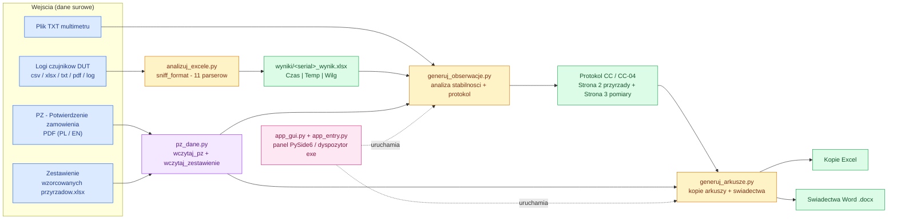
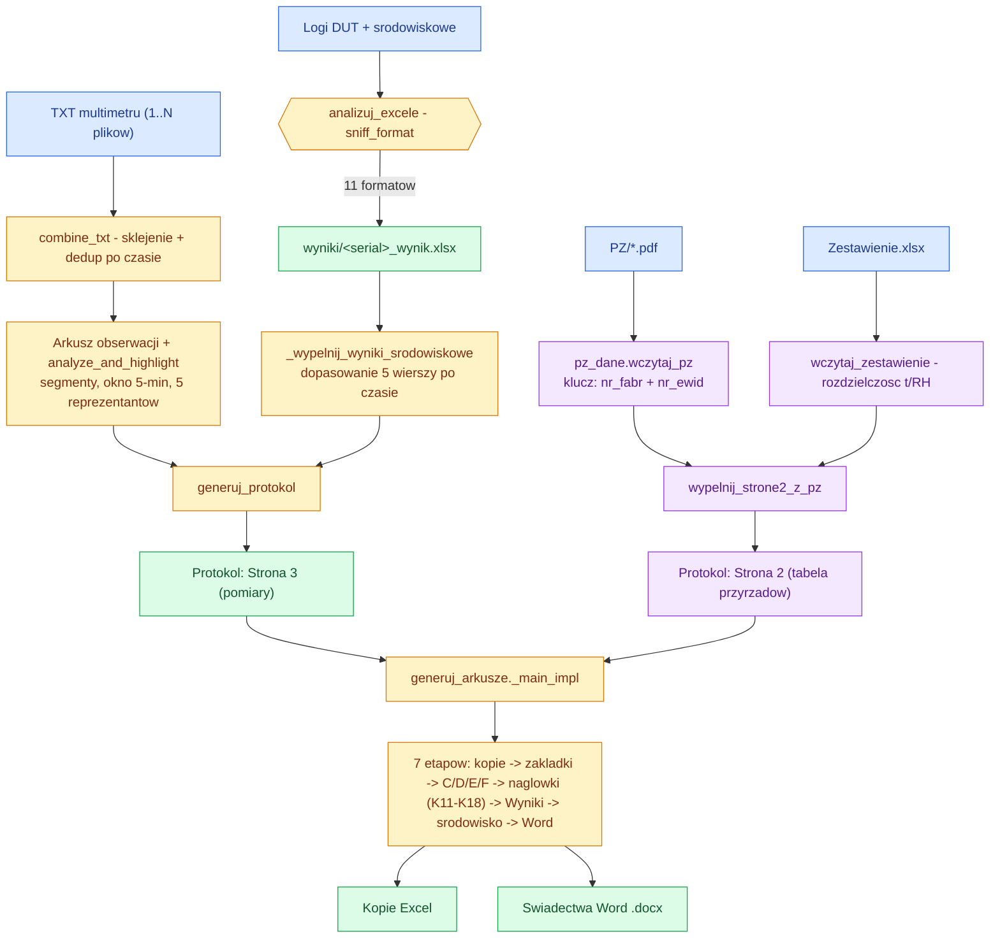
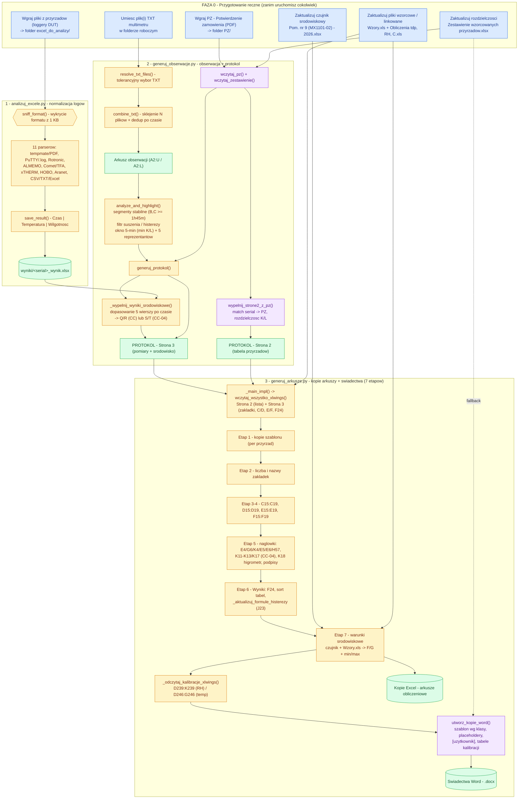
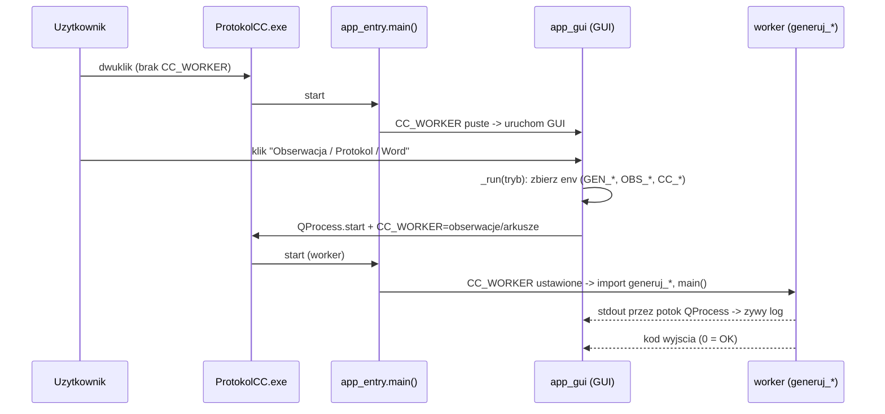
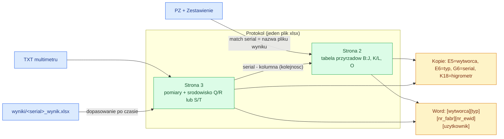

# Generator arkuszy i protokołów wzorcowania (CC / CC‑04)

Zestaw skryptów **Python** automatyzujący pełny obieg wzorcowania termohigrometrów
w akredytowanym laboratorium pomiarowym: od surowych logów czujników, przez analizę
stabilności i protokoły, po arkusze obliczeniowe **Excel** i świadectwa **Word** — spięty
desktopowym panelem **PySide6** i spakowany w jeden plik `ProtokolCC.exe`.

> 📊 **Pełna interaktywna infografika:** [`DOKUMENTACJA/infografika-projektu.html`](DOKUMENTACJA/infografika-projektu.html)
> (opisy każdej funkcji i ustawienia + diagramy). Otwórz w przeglądarce.

---

## 🗺️ Architektura — zależności modułów



**Kluczowa zależność kolejności:** `analizuj_excele` musi wygenerować `wyniki/*` zanim
`generuj_obserwacje` dopasuje je czasowo do Strony 3. PZ wczytywany jest na starcie
obserwacji, a dopasowanie *przyrząd ↔ kolumna pomiarowa* idzie po **nr fabrycznym lub
nr ewidencyjnym** = serial z nazwy pliku wyniku.

---

## 🔄 Pipeline danych — przepływ działań (end‑to‑end)



---

## 🌳 Pełny obieg pracy — od plików do świadectw (mega‑schemat)

Jedno drzewo spinające cały proces: co i gdzie wgrać ręcznie, które pliki wzorcowe zaktualizować,
a potem kolejno **analiza → obserwacja/protokół → arkusze/świadectwa** ze wszystkimi etapami.



**Kolejność:** FAZA 0 (ręcznie) → `analizuj_excele` (→ `wyniki/*`) → `generuj_obserwacje`
(protokół: Strona 2 z PZ + Strona 3 z pomiarów) → `generuj_arkusze` (kopie Excel + świadectwa Word).
Pliki `Wzory.xls` / `Pom. nr 9` wchodzą dopiero w **Etap 7** arkuszy; `Zestawienie` i `PZ` — przy budowie Strony 2.

---

## ▶️ Uruchamianie — jeden exe, trzy tryby

Panel GUI uruchamia skrypty‑workery jako podprocesy. W zamrożonym `.exe` ten sam plik pełni
rolę i GUI, i workera — o trybie decyduje zmienna `CC_WORKER`.



---

## 🔗 Interakcje danych — Strona 2 ↔ Strona 3



**Reguła sprzężenia:** i‑ty przyrząd na Stronie 2 (wiersz 11+i) odpowiada i‑tej parze kolumn
pomiarowych na Stronie 3 (S:T, U:V… dla CC‑04). Liczba przyrządów = liczbie kolumn pomiarowych.
Rozdzielczość K/L: z Zestawienia (producent+typ), a gdy brak — z wahania cyfr po przecinku w danych.

---

## 📦 Moduły

| Plik | Linie | Funkcje | Rola | Biblioteki |
|---|---:|---:|---|---|
| `generuj_arkusze.py` | 3402 | 97 | Kopie arkuszy obliczeniowych Excel + świadectwa Word | xlwings, openpyxl, python‑docx |
| `generuj_obserwacje.py` | 1549 | 41 | Arkusz obserwacji + protokół (CC / CC‑04) z pliku TXT | openpyxl, xlwings (COM) |
| `analizuj_excele.py` | 1093 | 28 | Uniwersalny parser loggerów → `wyniki/*.xlsx` | pandas, openpyxl, pypdf |
| `pz_dane.py` | 346 | 16 | Parser PZ (PDF, PL/EN) + Zestawienie rozdzielczości | pypdf, openpyxl |
| `app_gui.py` | 472 | 26 | Panel sterujący PySide6 (Windows 11 Fluent) | PySide6 |
| `app_entry.py` | 83 | 3 | Dyspozytor zamrożonego exe (GUI ↔ worker) | — |

## 📥 Obsługiwane formaty loggerów (`analizuj_excele.py`)

`tempmate (PDF)` · `PuTTY/Vaisala (.log)` · `Rotronic HW4` · `ALMEMO` · `Comet/TFA` ·
`xTHERM (COM)` · `HOBO` · `Aranet` · `ElogVis` · generyczny `CSV` / `TXT` / `Excel`.
Wynik zawsze znormalizowany: **`Czas | Temperatura [°C] | Wilgotność [%RH]`**.

## 🔌 Kontrakt env‑var (GUI ↔ workery)

| Zmienna | Znaczenie |
|---|---|
| `CC_WORKER` | tryb: `arkusze` / `obserwacje` / (puste = GUI) |
| `CC_FOLDER` | folder roboczy |
| `CC_PROTOKOL` / `CC_SZABLON` | wybrany protokół / szablon |
| `CC_PZ_FOLDER` | folder PZ |
| `OBS_TXT_FILES` | lista TXT (średnik) — przerwany pomiar |
| `OBS_FILTR` / `OBS_PROG` / `OBS_TOL` | filtr / próg % / tolerancja min |
| `GEN_EXCEL` / `GEN_WORD` / `GEN_PUSTE` / `GEN_AUTOREC` | etapy i zachowania |

---

## 🚀 Uruchomienie

```powershell
# Z źródła (panel GUI):
.venv\Scripts\python.exe app_gui.py

# Pojedyncze skrypty:
.venv\Scripts\python.exe analizuj_excele.py            # excel_do_analizy/ -> wyniki/
.venv\Scripts\python.exe generuj_obserwacje.py         # TXT -> obserwacja + protokol
.venv\Scripts\python.exe generuj_arkusze.py            # protokol -> kopie + Word

# Budowa jednego .exe:
powershell -ExecutionPolicy Bypass -File build.ps1     # -> dist\ProtokolCC.exe
```

**Wymagania środowiska:** Windows 10/11, zainstalowany **Excel** (xlwings/COM),
dostęp do sieciowego `\\plum4\LabPomiarowe\Wzory.xls`. Zależności: `requirements.txt`
(`openpyxl · xlwings · python-docx · PySide6 · pandas · pypdf`).

### Sterowanie etapami (`generuj_arkusze.py`)

- `GENERUJ_EXCEL=True/False`, `GENERUJ_WORD=True/False`:
  `True/True` = pełny obieg · `True/False` = tylko Excel · `False/True` = Word z istniejących kopii.

### Warianty protokołu CC‑04

- Kolumny E/F na Stronie 3: CC = `Q/R`, CC‑04 = `S/T` (kolejne kopie +2 w prawo).
- Typ CC‑04 z wiersza 14 (`S:T14`…): tagi `LG` / `LD` / `PD` / `PG` → stałe `K11–K17`
  (Pt100‑09/01/18/13, 1586A‑02, …).

## 🆕 Ostatnie usprawnienia

- **PZ (Potwierdzenie zamówienia):** automatyczne wypełnianie tabeli przyrządów na Stronie 2
  (dwujęzycznie **PL/EN**), dopasowanie po nr fabrycznym **i** nr ewidencyjnym, blok `UŻYTKOWNIK/USER`
  → warianty szablonów Word `(uzytkownik)`.
- **analizuj_excele:** dodane formaty **PDF (tempmate)** i **PuTTY/Vaisala (.log)**.
- **generuj_obserwacje:** obsługa **wielu plików TXT** (przerwany pomiar, sklejanie + dedup),
  tolerancyjny wybór pliku, parser CC‑04 odporny na dodatkowe kanały.
- **generuj_arkusze:** konfigurowalny higrometr **`K18`** (temp‑only → „-"), automatyczna aktualizacja
  formuły histerezy **`Wyniki!J23`**, poprawka daty wzorcowania.

---

## 🤖 Agenty pomocnicze (`.claude/agents/`)

`python-pro` · `pyside6-desktop-expert` · `desktop-packager` · `debugger` ·
`code-reviewer` · `test-automator` · `project-visualizer` (analiza i wizualizacja architektury).

---

*Dokumentacja i diagramy generowane automatycznie z analizy kodu. Pełny opis każdej funkcji
i ustawienia: [`DOKUMENTACJA/infografika-projektu.html`](DOKUMENTACJA/infografika-projektu.html).*
